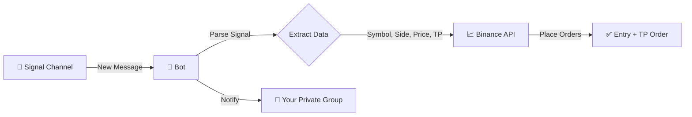

# 🤖 Telegram Trading Signal Bot

Automatically execute Binance Futures trades based on signals received from a Telegram channel.

## 📊 How It Works



### Flow Explanation

| Step | What Happens |
|------|--------------|
| 1️⃣ | Signal arrives in **Signal Channel** (public/private channel you're monitoring) |
| 2️⃣ | Bot parses the message → extracts Symbol, Side (Long/Short), Price, TP1 |
| 3️⃣ | Bot places **Entry Order** + **Take Profit Order** on Binance Futures |
| 4️⃣ | Bot sends confirmation (or error) to **Your Private Group** |

> **Result:** You get notified in your private group about every trade! 🚀
## 📁 Project Structure

```
ShantoohBot2/
├── bot.py              # Main bot logic
├── keep_alive.py       # Flask server to prevent sleep
├── generate_session.py # Run once to get SESSION_STRING
├── requirements.txt    # Python dependencies
├── .env                # API keys & config (create manually)
├── .gitignore          # Excludes sensitive files
└── README.md           # This file
```

## ⚙️ Configuration

Create a `.env` file with your credentials:

```env
TELEGRAM_API_ID=your_api_id
TELEGRAM_API_HASH=your_api_hash
SESSION_STRING=your_session_string
BINANCE_KEY=your_binance_key
BINANCE_SECRET=your_binance_secret
SIGNAL_CHANNEL_ID=-100xxxxxxxxxx
MY_PRIVATE_GROUP_ID=-100xxxxxxxxxx
LEVERAGE=5
MARGIN_USD=100
ISTESTING=true
```

**ISTESTING Mode:**
| Value | Behavior |
|-------|----------|
| `true` | Bot listens to private group, NO real trades, shows "Test Trade Placed" |
| `false` | Bot listens to signal channel, executes real trades on Binance |

---

## 📋 Step-by-Step Setup Guide

### Step 1: Get Telegram API Credentials

1. Go to **https://my.telegram.org**
2. Login with phone number (with country code: `+919876543210`)
3. Enter OTP received in Telegram
4. Click **"API development tools"**
5. Fill form:
   - App title: `TradingBot`
   - Short name: `tradingbot`
   - Platform: `Desktop`
   - URL: (leave empty)
6. Click **Create application**
7. Copy `App api_id` → `TELEGRAM_API_ID`
8. Copy `App api_hash` → `TELEGRAM_API_HASH`

> **Note:** FCM credentials are NOT needed.

---

### Step 2: Get Binance API Credentials

1. Go to **https://www.binance.com** → Login
2. Profile → **API Management**
3. Click **Create API** → Select **System generated**
4. Label: `TradingBot` → Complete 2FA
5. Copy `API Key` → `BINANCE_KEY`
6. Copy `Secret Key` → `BINANCE_SECRET` (shown once!)
7. **Edit Restrictions:**
   - ✅ Enable Futures
   - ✅ Enable Reading
   - ❌ Disable Withdraw (for safety)

#### ⚠️ IP Restriction (Required for Futures)

Binance requires IP whitelist when Futures is enabled. Add your IP:

**For Local Testing:**
```bash
# Windows - Get your public IP
curl ifconfig.me

# Or visit: https://whatismyip.com
```

Copy your public IP (e.g., `103.45.67.89`) and add it to Binance API restrictions.

**For Cloud Deployment (Render/Railway):**
- Free tiers have dynamic IPs - may need paid plan with static IP
- Or use a VPS with fixed IP

---

### Step 3: Get Channel/Group IDs

**Method 1: Using @userinfobot**
1. Forward any message from signal channel → `@userinfobot`
2. Copy the ID (e.g., `-1001234567890`) → `SIGNAL_CHANNEL_ID`

**Method 2: Using Telegram Web (Recommended)**
1. Open https://web.telegram.org/a/
2. Go to the channel/group
3. Look at URL: `https://web.telegram.org/a/#-1001234567890`
4. Copy the number after `#` (including the minus sign)

**For your private group:**
- If URL shows `#-5160897944`, use `-1005160897944` (add `100` after the minus)
- Format: `-100` + `group_id`

| ID Type | URL Example | Use in .env |
|---------|-------------|-------------|
| Channel | `#-1001234567890` | `-1001234567890` |
| Group | `#-5160897944` | `-1005160897944` |

---

## 🔑 Generate Session String

```bash
# 1. First fill TELEGRAM_API_ID and TELEGRAM_API_HASH in .env
# 2. Run:
python generate_session.py

# 3. Copy the output and paste into SESSION_STRING in .env
```

## 🚀 Local Setup

```bash
# Install dependencies
pip install -r requirements.txt

# Run bot
python bot.py
```

## 📡 Signal Format

The bot parses signals in this format:

```
#COINNAME | Open Long
Current price: 0.02926
TP 1: 0.029556 - Probability 94%
...
```

**Extracted Data:**
| Field | Example | Usage |
|-------|---------|-------|
| Symbol | `#CUDIS` → `CUDISUSDT` | Trading pair |
| Side | `Open Long` → `BUY` | Order direction |
| Price | `0.02926` | Limit order price |
| TP1 | `0.029556` | Take profit price |

## 🌐 Deployment (Oracle Cloud Free Tier)

Oracle Cloud offers **Always Free** VMs with **static IP** - perfect for Binance API!

### Step 1: Create Oracle Cloud Account
1. Go to https://cloud.oracle.com/free
2. Sign up (credit card required, but won't be charged)
3. Select "Always Free" resources only

### Step 2: Create VM Instance
1. Navigate to **Compute → Instances → Create Instance**
2. Choose **Ubuntu 22.04** image
3. Select shape: **VM.Standard.E2.1.Micro** (Always Free)
4. Download SSH key pair when creating
5. Note the **Public IP Address** after creation

### Step 3: Add IP to Binance Whitelist
Go to Binance API settings and add your VM's public IP to the whitelist.

### Step 4: Connect & Deploy
```bash
# SSH into your VM
ssh -i your-key.pem ubuntu@YOUR_VM_IP

# Update system
sudo apt update && sudo apt upgrade -y

# Install Python
sudo apt install python3 python3-pip git -y

# Clone your repo
git clone https://github.com/YOUR_USERNAME/TradingBotTelegram2.git
cd TradingBotTelegram2

# Install dependencies
pip3 install -r requirements.txt

# Create .env file with your credentials
nano .env

# Run bot in background
nohup python3 bot.py > bot.log 2>&1 &

# Check if running
ps aux | grep bot.py
```

### Step 5: Run as System Service (Recommended)
```bash
# Create service file
sudo nano /etc/systemd/system/tradingbot.service
```

Paste:
```ini
[Unit]
Description=Trading Bot
After=network.target

[Service]
User=ubuntu
WorkingDirectory=/home/ubuntu/TradingBotTelegram2
ExecStart=/usr/bin/python3 bot.py
Restart=always

[Install]
WantedBy=multi-user.target
```

Then:
```bash
sudo systemctl enable tradingbot
sudo systemctl start tradingbot
sudo systemctl status tradingbot
```

## ⚠️ Disclaimer

This bot executes real trades. Use at your own risk. Always test with small amounts first.

---

## 👨‍💻 Author

**Abhijit Gawai**

*✨ Vibe coded with [Antigravity](https://deepmind.google/) using Claude Opus 4.5 Thinking*
