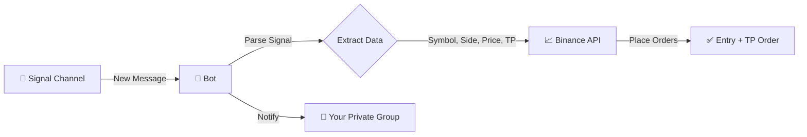

# 🤖 Telegram Trading Signal Bot

Automatically execute Binance Futures trades based on signals received from a Telegram channel.

## 📊 How It Works



### Flow Explanation

| Step | What Happens |
|------|--------------|
| 1️⃣ | Signal arrives in **Signal Channel** (public/private channel you're monitoring) |
| 2️⃣ | Bot parses the message → extracts Symbol, Side (Long/Short), Price, TP1 |
| 3️⃣ | Bot places **Entry Order** + **Take Profit Order** on Binance Futures |
| 4️⃣ | Bot sends confirmation (or error) to **Your Private Group** |

> **Result:** You get notified in your private group about every trade! 🚀

## 📁 Project Structure

```
ShantoohBot2/
├── bot.py              # Main bot logic
├── keep_alive.py       # Flask server to prevent sleep
├── generate_session.py # Run once to get SESSION_STRING
├── requirements.txt    # Python dependencies
├── .env                # API keys & config (create manually)
├── .gitignore          # Excludes sensitive files
└── README.md           # This file
```

## ⚙️ Configuration

Create a `.env` file with your credentials:

```env
TELEGRAM_API_ID=your_api_id
TELEGRAM_API_HASH=your_api_hash
SESSION_STRING=your_session_string
BINANCE_KEY=your_binance_key
BINANCE_SECRET=your_binance_secret
SIGNAL_CHANNEL_ID=-100xxxxxxxxxx
MY_PRIVATE_GROUP_ID=-100xxxxxxxxxx
LEVERAGE=5
MARGIN_USD=100
ISTESTING=true
```

**ISTESTING Mode:**
| Value | Behavior |
|-------|----------|
| `true` | Bot listens to private group, NO real trades, shows "Test Trade Placed" |
| `false` | Bot listens to signal channel, executes real trades on Binance |

---

## 📋 Step-by-Step Setup Guide

### Step 1: Get Telegram API Credentials

1. Go to **https://my.telegram.org**
2. Login with phone number (with country code: `+919876543210`)
3. Enter OTP received in Telegram
4. Click **"API development tools"**
5. Fill form:
   - App title: `TradingBot`
   - Short name: `tradingbot`
   - Platform: `Desktop`
   - URL: (leave empty)
6. Click **Create application**
7. Copy `App api_id` → `TELEGRAM_API_ID`
8. Copy `App api_hash` → `TELEGRAM_API_HASH`

> **Note:** FCM credentials are NOT needed.

---

### Step 2: Get Binance API Credentials

1. Go to **https://www.binance.com** → Login
2. Profile → **API Management**
3. Click **Create API** → Select **System generated**
4. Label: `TradingBot` → Complete 2FA
5. Copy `API Key` → `BINANCE_KEY`
6. Copy `Secret Key` → `BINANCE_SECRET` (shown once!)
7. **Edit Restrictions:**
   - ✅ Enable Futures
   - ✅ Enable Reading
   - ❌ Disable Withdraw (for safety)

#### ⚠️ IP Restriction (Required for Futures)

Binance requires IP whitelist when Futures is enabled. Add your IP:

**For Local Testing:**
```bash
# Windows - Get your public IP
curl ifconfig.me

# Or visit: https://whatismyip.com
```

Copy your public IP (e.g., `103.45.67.89`) and add it to Binance API restrictions.

**For Cloud Deployment:**
- Use your GCP VM's static IP (see deployment section below)

---

### Step 3: Get Channel/Group IDs

**Using Telegram Web (Recommended)**
1. Open https://web.telegram.org/a/
2. Go to the channel/group
3. Look at URL: `https://web.telegram.org/a/#-1001234567890`
4. Copy the number after `#` (including the minus sign)

| ID Type | URL Example | Use in .env |
|---------|-------------|-------------|
| Channel | `#-1001234567890` | `-1001234567890` |
| Group | `#-5160897944` | `-1005160897944` |

---

### Step 4: Generate Session String

```bash
# 1. First fill TELEGRAM_API_ID and TELEGRAM_API_HASH in .env
# 2. Run:
python generate_session.py

# 3. Copy the output and paste into SESSION_STRING in .env
```

---

## 🚀 Local Setup

```bash
# Install dependencies
pip install -r requirements.txt

# Run bot
python bot.py
```

---

## 📡 Signal Format

The bot parses signals in this format:

```
#COINNAME | Open Long
Current price: 0.02926
TP 1: 0.029556 - Probability 94%
...
```

**Extracted Data:**
| Field | Example | Usage |
|-------|---------|-------|
| Symbol | `#CUDIS` → `CUDISUSDT` | Trading pair |
| Side | `Open Long` → `BUY` | Order direction |
| Price | `0.02926` | Limit order price |
| TP1 | `0.029556` | Take profit price |

---

## 🌐 Deployment on Google Cloud Platform (FREE!)

### Why Google Cloud?
- ✅ **Static IP** (required for Binance API whitelist)
- ✅ **$300 free credits** for 90 days
- ✅ **Always Free tier** after credits
- ✅ **UPI payment** accepted in India (₹1000 refundable deposit)

---

### Step 1: Create Google Cloud Account

1. Go to **https://cloud.google.com/free**
2. Click **"Get started for free"**
3. Sign in with Google account
4. Payment: Select **UPI** → Pay ₹1000 (refundable deposit)
5. Get **$300 free credits**!

---

### Step 2: Create VM Instance

1. Go to **https://console.cloud.google.com**
2. Search **"Compute Engine"** → Click it → Enable API
3. Click **"Create Instance"**

#### VM Configuration (Lowest Cost - FREE!):

| Section | Field | Value |
|---------|-------|-------|
| **Name** | Name | `trading-bot` |
| **Region** | Region | `asia-south1 (Mumbai)` |
| **Region** | Zone | `asia-south1-a` |
| **Machine** | Machine family | `General-purpose` |
| **Machine** | Series | `E2` |
| **Machine** | Machine type | `e2-micro` (2 vCPU, 1 GB) ✅ FREE |
| **Machine** | Provisioning model | `Standard` |
| **OS & Storage** | Operating System | `Ubuntu` |
| **OS & Storage** | Version | `Ubuntu 22.04 LTS x86/64` |
| **OS & Storage** | Boot disk type | `Standard persistent disk` |
| **OS & Storage** | Size | `30 GB` |
| **Networking** | Allow HTTP traffic | ✅ Checked |
| **Networking** | Allow HTTPS traffic | ✅ Checked |
| **Networking** | Allow Load Balancer | ❌ Unchecked |
| **Observability** | Install Ops Agent | ❌ Unchecked (optional) |
| **Advanced** | Deletion protection | ✅ Enabled (recommended) |

4. Click **"Create"** → Wait 1-2 minutes

---

### Step 3: Reserve Static IP (IMPORTANT!)

1. Go to **VPC Network → IP addresses**
2. Click **"Reserve external"**
3. Fill:
   - Name: `trading-bot-ip`
   - Region: `asia-south1`
   - Attached to: `trading-bot` (your VM)
4. Click **"Reserve"**
5. Note your IP (e.g., `34.100.182.165`) ← **This will never change!**

---

### Step 4: Add IP to Binance Whitelist

1. Go to **Binance → API Management**
2. Click **Edit** on your API key
3. Under **IP Access Restrictions** → Add your GCP IP (e.g., `34.100.182.165`)
4. Save

---

### Step 5: Connect to VM via SSH

1. Go to **Compute Engine → VM instances**
2. Find your VM → Click **"SSH"** button
3. A terminal opens in your browser!

---

### Step 6: Setup Bot on VM

Run these commands:

```bash
# 1. Update system
sudo apt update && sudo apt upgrade -y

# 2. Install Python & Git
sudo apt install python3 python3-pip git -y

# 3. Clone your code
git clone https://github.com/YOUR_USERNAME/ShantoohBot2.git
cd ShantoohBot2

# 4. Install dependencies
pip3 install -r requirements.txt

# 5. Create .env file
nano .env
# (Paste your secrets, then Ctrl+X → Y → Enter)

# 6. Test the bot
python3 bot.py
# Should show: "🚀 PRODUCTION MODE: Listening..."
# Press Ctrl+C to stop
```

---

### Step 7: Run Bot 24/7 (Systemd Service)

```bash
# Create service file
sudo nano /etc/systemd/system/tradingbot.service
```

Paste:
```ini
[Unit]
Description=Trading Bot
After=network.target

[Service]
User=YOUR_USERNAME
WorkingDirectory=/home/YOUR_USERNAME/ShantoohBot2
ExecStart=/usr/bin/python3 bot.py
Restart=always
RestartSec=10

[Install]
WantedBy=multi-user.target
```

> Replace `YOUR_USERNAME` with your actual username (run `whoami` to check)

Then:
```bash
sudo systemctl daemon-reload
sudo systemctl enable tradingbot
sudo systemctl start tradingbot
sudo systemctl status tradingbot
```

---

### Useful Commands

| Command | Purpose |
|---------|---------|
| `sudo systemctl status tradingbot` | Check if running |
| `sudo systemctl restart tradingbot` | Restart bot |
| `sudo systemctl stop tradingbot` | Stop bot |
| `sudo journalctl -u tradingbot -f` | View live logs |
| `nano ~/ShantoohBot2/.env` | Edit config |

---

### Cost Summary

| Component | Monthly Cost |
|-----------|--------------|
| e2-micro VM (744 hrs) | **$0** (free tier) |
| 30 GB Standard disk | ~$1.20 |
| Static IP (attached) | **$0** |
| **Total** | ~$1.20/month (covered by $300 credits for 250 months!) |

### 💳 Billing & Payment Notes

**Q: I paid ₹1000 via UPI and deleted the autopay. Will I be charged?**

| Scenario | What Happens |
|----------|--------------|
| Stay within free tier | ✅ No charges, ₹1000 stays as credit |
| Use only free resources | ✅ Safe, no deductions |
| Exceed free tier | ⚠️ Google emails you, service pauses (no surprise charges) |
| Delete payment method | ✅ OK if staying in free tier |

**Important:**
- Your ₹1000 deposit is converted to ~$12 credit (added to $300 free credits)
- Google **cannot charge you** without a valid payment method
- If you exceed limits, service pauses - you won't be billed unexpectedly
- To be safe: Set up **Budget Alerts** in GCP Console → Billing → Budgets

---

## ⚠️ Disclaimer

This bot executes real trades. Use at your own risk. Always test with small amounts first.

---

## 👨‍💻 Author

**Abhijit Gawai**

*✨ Vibe coded with [Antigravity](https://deepmind.google/) using Claude Opus 4.5 Thinking*

