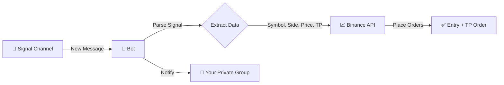

# 🤖 Telegram Trading Signal Bot

Automatically execute Binance Futures trades based on signals received from a Telegram channel.

## 📊 How It Works



### Flow Explanation

| Step | What Happens |
|------|--------------|
| 1️⃣ | Signal arrives in **Signal Channel** (public/private channel you're monitoring) |
| 2️⃣ | Bot parses the message → extracts Symbol, Side (Long/Short), Price, TP1 |
| 3️⃣ | Bot places **Entry Order** + **Take Profit Order** on Binance Futures |
| 4️⃣ | Bot sends confirmation (or error) to **Your Private Group** |

> **Result:** You get notified in your private group about every trade! 🚀
## 📁 Project Structure

```
ShantoohBot2/
├── bot.py              # Main bot logic
├── keep_alive.py       # Flask server to prevent sleep
├── generate_session.py # Run once to get SESSION_STRING
├── requirements.txt    # Python dependencies
├── .env                # API keys & config (create manually)
├── .gitignore          # Excludes sensitive files
└── README.md           # This file
```

## ⚙️ Configuration

Create a `.env` file with your credentials:

```env
TELEGRAM_API_ID=your_api_id
TELEGRAM_API_HASH=your_api_hash
SESSION_STRING=your_session_string
BINANCE_KEY=your_binance_key
BINANCE_SECRET=your_binance_secret
SIGNAL_CHANNEL_ID=-100xxxxxxxxxx
MY_PRIVATE_GROUP_ID=-100xxxxxxxxxx
LEVERAGE=5
MARGIN_USD=100
```

## 🔑 Generate Session String

```bash
# 1. First fill TELEGRAM_API_ID and TELEGRAM_API_HASH in .env
# 2. Run:
python generate_session.py

# 3. Copy the output and paste into SESSION_STRING in .env
```

## 🚀 Local Setup

```bash
# Install dependencies
pip install -r requirements.txt

# Run bot
python bot.py
```

## 📡 Signal Format

The bot parses signals in this format:

```
#COINNAME | Open Long
Current price: 0.02926
TP 1: 0.029556 - Probability 94%
...
```

**Extracted Data:**
| Field | Example | Usage |
|-------|---------|-------|
| Symbol | `#CUDIS` → `CUDISUSDT` | Trading pair |
| Side | `Open Long` → `BUY` | Order direction |
| Price | `0.02926` | Limit order price |
| TP1 | `0.029556` | Take profit price |

## 🌐 Deployment (Render/Railway)

1. Push code to GitHub (private repo recommended)
2. Connect repo to Render/Railway
3. Set environment variables in dashboard
4. Deploy!

**Keep Alive:** Use [UptimeRobot](https://uptimerobot.com/) to ping your URL every 5 mins.

## ⚠️ Disclaimer

This bot executes real trades. Use at your own risk. Always test with small amounts first.

---

## 👨‍💻 Author

**Abhijit Gawai**

*✨ Vibe coded with [Antigravity](https://deepmind.google/) using Claude Opus 4.5 Thinking*
